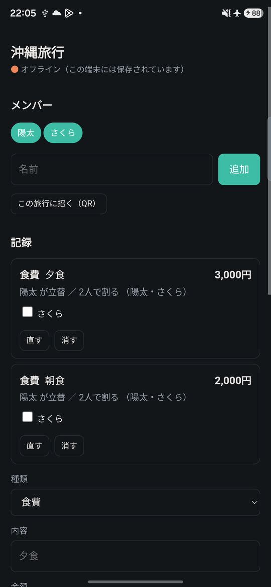
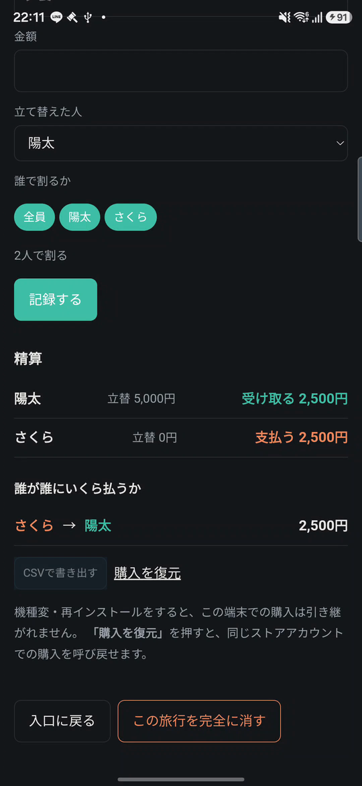

# Michizure

**Splitting trip costs, for the trip you are actually on.**
No accounts. Works with no signal. The server stores only ciphertext and thin metadata.

## The problem is not the arithmetic

Dividing a restaurant bill is easy. What breaks on an actual trip is everything around it:

- **Signal is worst exactly where you need to record.** Mountains, ferries, basements, abroad on
  a bad roaming plan. You note "¥4,200, Sato paid" *then*, or you never note it.
- **Asking five friends to sign up ends the conversation.** By the time everyone has made an
  account, someone has given up and you are back to a group chat and a notes app.

## Demo

**Video:** _link to follow._

| Recording an expense with the network off | The settlement view |
|---|---|
|  |  |

_(The app's interface is in Japanese.)_

A 75-second walkthrough on an Android phone: switch on airplane mode, add an expense while offline
(it is saved to the device first), switch airplane mode off and watch the room return to "saved".
Then the CSV export — gated behind the one-time purchase, shown with RevenueCat's Test Store dialog —
followed by the exported file in the OS share sheet. Room creation is not in the video; "Run locally"
below shows it.

## What this is not

There are good split-billing apps. **This one does not beat them on features.** Ten existing
services were surveyed while designing it — Walica, Splitwise, タテカリ, レコペイ, groupay, Nowa,
Walimo, FAMI-KAN, ワリナビ, TATEKA — and every feature first considered "our differentiator"
already shipped somewhere.

So this is not a better spreadsheet. It is a **narrower tool that gives up different things.**

## What we gave up, and what that bought

| Given up | Bought |
|---|---|
| Accounts, sign-up, password reset | A room is a URL plus a passphrase. Nothing to create, nothing to lose but the passphrase |
| The server being able to read your data | It is also **unable to help you recover it**: we cannot reset or recover a lost passphrase |
| Reading IP addresses in our own code | Nothing in our code can tell one client from another, so nothing throttles per client. Passphrase guesses are backed off per room (which lets anyone lock a room — see Limitations); room creation has one global limit that did not enforce in production when we measured it on 2026-09-18. **This does not mean no IP is recorded anywhere** — see below |
| A framework | **18,746 bytes gzipped** before the app is usable, and it keeps working with no network |
| Automatic resolution of conflicting edits | When two devices change the *same expense*, you are **shown both versions and asked to choose**; until you do, this device sends nothing to the server. Edits that do not collide still merge automatically |

## What the server actually holds

We would rather be precise here than reassuring.

- **The room's ciphertext and its IV.** Encryption and decryption happen in your browser; the key
  is derived from the passphrase and never sent.
- **Plaintext metadata:** room ID, the time of the last successful entry (creation counts; there is
  no separate creation time), the KDF salt, a hash of the auth key, the KDF parameters, and small
  version numbers including a write counter (`rev`). Room size and how often it changes are
  therefore visible.
- **Material for offline guessing.** The salt and KDF parameters are served without authentication
  (a client needs them before it can derive a key), and together with the auth-key hash they are
  what someone holding the storage would need to test passphrase guesses offline. That is why the
  passphrase is generated by default and why its strength matters.
- **A per-room record of failed entry attempts** — a count, a wall-clock timestamp of the last
  failure, and when the room is unblocked. Every room that has ever been entered carries it.
- **Application logs are off** — `[observability] enabled = false`, enforced by a check that runs
  before `npm test`.
- **Our code never reads any IP header** (`CF-Connecting-IP` and friends), also enforced by that check.
- **But the platform does.** Cloudflare retains request data including IP addresses — Security
  Events for 24 hours and Security Analytics for 7 days on the free plan, plus its own edge logs
  for a period Cloudflare does not publish. We cannot switch this off, and we will not imply we have.

**On your device, the room's contents and its decryption key are stored in plaintext** so the app
works offline and can reopen the room without asking for the passphrase. The passphrase is still
asked for to resume syncing once the 30-day connection token has expired, and before a room is
deleted. That is a deliberate trade for usability; it is also the largest hole in the design. See
Limitations.

## Design choices, and why

**Local-first, not offline-as-a-feature.** Every change commits to the device *first*; the network
is attempted afterwards. Reversing that order is the difference between "the app is slow on bad
signal" and "the entry you typed is gone after a reload".

**The app itself is cached, not just the data.** A service worker stores the shell, so reloading —
or reopening the browser — works with no network at all. Without it "works with no signal" would be
only half true: your records would survive, but the app would not load to show them. It installs
after the first online load, and only in the web build; the native shell bundles its assets instead.

**Same-record conflicts are surfaced, not guessed at.** Two people editing offline is normal on a
trip, and most of it never collides: expenses added on each side merge automatically, with a
one-line notice. Only when both devices changed the *same* expense does the app show both versions
of that record and ask you to pick one; the one you don't pick is discarded. Until you choose, this
device keeps saving locally but sends nothing to the server, so the other side's version cannot be
overwritten while the question is open. The reasoning is that silently overwriting someone's
evening of receipts is worse than asking. One limit: the trip name, dates and member names are
simpler — if both sides changed one, this device's value wins without asking.

**The passphrase is generated by default.** Five words from a 1,024-word list (~50 bits). Doubling
the KDF iteration count buys 1 bit; adding one word buys 10. Strength has to come from the
passphrase, so the app generates one for you. You may type your own instead, and that path is
weaker by construction — it is gated by an entropy estimate with a floor of 40 bits, measured on the
normalized string that actually becomes the key rather than on the raw input. That floor is a check
in the shipped client only (the server never sees the passphrase), and the estimate is a heuristic,
not a proof of guessing resistance.

**The passphrase is normalized before it becomes a key.** Japanese voicing marks have several
encodings that look identical on screen. Without normalization the same passphrase typed on two
devices derives two different keys — a failure whose symptom ("wrong passphrase") points nowhere
near its cause. The normalization is four ordered steps and the order is part of the contract.

**Key-derivation parameters are stored per room.** Iteration count and normalization version live
with the room, so changing the defaults later cannot lock anyone out of a room created today. This
is not hypothetical: an audit found a missing normalization step on 2026-09-05, and the fix shipped
as a new KDF version rather than a change to version 1, because we could not rule out a room
already existing under it, and editing version 1 in place would have made any such room unopenable.

**Money is divided in whole yen, and the remainder is assigned, not rounded away.** ¥100 between
three people is 34/33/33, not three rounded 33.33s that fail to add up. Which participant carries
the extra yen is derived from the expense's own ID, so it varies between expenses and is identical
on every device.

**The API origin is read from a `<meta>` tag, not baked in at build time.** You can open the shipped
artifact and see where it talks to. A build-time constant would be invisible.

## Monetization

**RevenueCat is integrated**, in the native (Capacitor) shell only — the web build does nothing
with it. It powers a single one-time purchase, gating a CSV export of the room's expenses and
settlement. Configuration, purchase, and restore live in `src/client/billing.ts`; the exported
file itself is built in `src/client/csv.ts` and handed to the OS share sheet by
`src/client/export-share.ts`.

**In this submission the purchase runs against RevenueCat's Test Store**, as the demo video shows;
the app is not released to any store, so no real-money purchase is possible yet. The RevenueCat
public keys are not in the repository (the `michizure-revenuecat-*-key` meta tags are empty until the
shell is built with `MICHIZURE_REVENUECAT_IOS_KEY` / `MICHIZURE_REVENUECAT_ANDROID_KEY`), so a shell
built from a fresh clone cannot complete a purchase.

The hard part is not checkout. It is that **this app has no accounts**, so there is no user to
attach an entitlement to. Three options exist, and each costs something real:

- **Attach to the room** — the server would have to store "this room is paid", which adds a field
  to what the server retains and moves the ground under the privacy policy.
- **Introduce accounts** — undoes the premise of the product.
- **Attach to the device** (chosen) — keeps the server ignorant, at the cost of purchases not
  following you to a new device on their own (a Restore button asks RevenueCat and the store to
  re-link them to the same App Store / Google Play account) and not following a shared room.

Because *our* server must stay ignorant of payment (in the native shell the RevenueCat SDK talks to
RevenueCat directly), **paid features are constrained to things
decidable entirely on the device**: export, local summaries, presentation. Anything requiring the
server to behave differently for a paying user is excluded by construction, not by preference.

The part worth building carefully is **entitlement while offline**: an app designed to work with no
signal must decide what a paying user sees when RevenueCat cannot be reached.

## Measured numbers

Measured with `gzip -9` (each file separately) after `npm run build:client`, at commit `f14caad`. **Every measured row carries its own measurement date**; the last two rows are constants read from `src/types.ts` at that commit, not measurements. The first-load figure has been quoted as 9,441, 10,864, 11,402, 11,493, 17,893, 18,454 and now 18,746 B. **Only the first move (9,441 → 10,864 B) was a measurement correction**; every later move followed real code. The last two: +561 B was the MIT redistribution banner (+657 B) net of −96 B from everything else, and +292 B (all in `app.js`) is the pending-conflict sync fix. The RevenueCat SDK itself stays lazy-loaded and is confirmed absent from the static chunks (re-checked 2026-09-19 against esbuild's metafile; `build:client` deletes `.build-meta.json` at the end, so re-run the esbuild step alone to regenerate it). A measured number without a date in this table is a bug.

"Before the app is usable" is `index.html` plus `app.js` plus every chunk reachable from `app.js` through static `import` statements; every other chunk is lazy.

| | |
|---|---|
| **Before the app is usable** (2026-09-19) | **18,746 B** — HTML 4,591 + app 10,933 + three shared chunks (913 + 1,360 + 949) |
| Fetched only when creating a room (2026-09-19) | 4,789 B (word list + passphrase generation) |
| Fetched only when importing old data (2026-09-19) | 1,173 B |
| Service worker (does not block first paint, 2026-09-19) | 1,118 B |
| Every asset the app can ever fetch (2026-09-19) | 48,634 B — see note below |
| Key derivation, 600,000 PBKDF2 iterations | **70 ms** — one Android device, Chrome 151, median of 3 (2026-08-14) |
| Tests (run 2026-09-19) | **302** (25 files) |
| Room auto-deletion | 365 days after the last successful passphrase entry (creation counts); writing does not extend it |
| Ciphertext ceiling enforced by the server | 256 KiB |

The KDF timing is **one device**. It is fast enough that no per-device tuning was needed, but it is
not a claim about phones in general.

**Note on "every asset the app can ever fetch":** as of 2026-09-19 this is defined as `index.html`
+ all 17 JavaScript files (`app.js` and 16 chunks) + `sw.js`, each gzipped separately and summed;
icons, the web manifest and `robots.txt` are not counted. Of the 48,634 B, **2,826 B is the MIT
redistribution banner** that every JavaScript file now carries (about 166 B each; without it the same
files total 45,808 B). Earlier figures of this row cannot be compared with today's. The 2026-09-06
figure (18,263 B) recorded no definition. The 2026-09-17 figure (46,974 B) was recorded as
`index.html` + `app.js` + 13 chunks + `sw.js`, but today's build has 16 chunks, and 46,974 B is
*higher* than today's banner-free total although the static files, banner aside, grew by only about
200 B in between.
That gap is unexplained, so **neither figure must be read as a like-for-like trend**. Only the
2026-09-19 figure has a definition that matches the build it was measured on.

## Run locally

Requires Node 22 or newer (`wrangler` refuses to start on anything older; developed and verified on
Node 24), a POSIX shell (`build:client` runs `rm -f`), and a Cloudflare Workers toolchain (`wrangler`,
installed as a dev dependency).

```bash
npm install
npm run dev      # builds the client bundle, then starts wrangler dev
```

`npm run dev` prints the local URL. Open it and create a room; from then on that room works with no
server — stop it, reload, and you can still open the room and record expenses. Creating a room, or
joining one without a QR entry ticket, still needs the server.

```bash
npm test         # rebuilds the client, runs eight consistency checks (privacy config, word list,
                 # icons, public surface, stored fields, privacy-policy rows and quotes, license
                 # banner), then the 302 tests
npx vitest run   # the tests alone
npm run typecheck
npm run build:wordlist   # regenerates the word list, its bundled copy and wordlist/review.md
```

`npm test` works on a fresh clone of the published files: it builds the client itself, and the two
checks that read privacy-policy and terms drafts (`check-pp-rows`, `check-pp-ui-quotes`) print that
they are skipped when those unpublished drafts are absent, rather than failing. It rebuilds `public/`
for **web** delivery (empty API origin) — if you build the native shell, use `npm run build:shell`,
not `npm test` followed by `npx cap sync`, or the shell inherits that empty origin. `npm test` also
runs before `npm run deploy` (via `predeploy`). `npm run test:watch`, `npx vitest run` and a direct
`wrangler deploy` bypass the checks, and there is no CI, so the checks gate only `npm test` and
`npm run deploy`.

The token-signing secret lives in `.dev.vars` and is a **development value only**, checked into the
repository on purpose so `npm run dev` and `npm test` work on a fresh clone without setup. A
deployment sets the real one with
`wrangler secret put TOKEN_SECRET`; it must never be added to `wrangler.toml`, because a `[vars]`
entry **replaces** the deployed secret.

## Limitations

- **A lost passphrase means we cannot recover the room for you.** No new device can join, and a
  device that has already opened the room stops syncing once its 30-day connection token lapses (it
  keeps a readable local copy — see the device bullet below). The server's copy is deleted 365 days
  after the last passphrase entry. This is structural, not a missing feature.
- **Anyone with the URL and the passphrase can read everything in that room.** Send them through
  different channels; both in one message means one leak opens the room.
- **There is no way to remove a member or change a room's passphrase**, and anyone who holds the
  passphrase can delete the room for everyone. Access tokens are stateless and last 30 days, so there
  is no per-token revocation either.
- **On a device where the room has been opened, no passphrase is needed to read it again.** The
  contents and the decryption key are held in that browser's local storage, so a shared or stolen
  device exposes the room. Records you delete or edit also linger in plaintext in the sync base until
  the next successful sync, and the exported CSV is written unencrypted to the app's cache
  directory and left there for the OS to reclaim. Delete the room from the device to clear the
  stored copy.
- **Local-first durability is best-effort.** The app does not ask the browser for persistent
  storage, and a failed write to local storage (full or disabled) is not handled specially.
- **This encryption is not verifiable by you.** We serve the JavaScript that does the encrypting.
  We design it so we cannot read your data, and we will not claim more than that.
- **Metadata is not encrypted** — see "What the server actually holds".
- **The connection indicator does not probe reachability.** It now flips the moment the device
  loses its network interface — airplane mode, for instance — but a connection that is up but going
  nowhere is only noticed when the socket itself fails. Your data is not affected either way — it is
  saved to the device first, regardless of what the indicator says.
- **After a page reload or an app restart, an open conflict question gets coarser.** Which records
  collided is remembered only in memory, so the per-record question is replaced by a choice between
  the two whole copies ("this device: N people, M records" or "the other device"); the one you don't
  pick is discarded, and choosing this device drops whatever the other side added after the conflict
  was detected. Nothing is sent to the server before you choose, either way. The marker that a
  question is open is kept in the device's local storage, so it also holds across tabs of the same
  origin.
- **Anyone who knows a room's URL can temporarily lock it** by failing the passphrase. Backoff
  starts at the 5th failure (1 minute) and doubles to at most 1 hour, clearing after 24 hours
  without failures. Because our code cannot tell clients apart, the block lands on the room rather
  than on whoever caused it. While a room is locked, entering it — and deleting it — is refused;
  devices that already hold an unexpired token keep syncing.
- **Room creation is unauthenticated, and its rate limit is weak.** `handleCreateRoom` consults one
  Workers Rate Limiting binding (20 requests per 60 s, a single key shared by all callers because our
  code does not read IP addresses). Cloudflare documents that binding as permissive and eventually
  consistent, not meant for exact counting, and in a production test on 2026-09-18 about 195
  consecutive requests never received a 429. Treat it as a speed bump, not a limit. The realistic
  cost is junk ciphertext (up to 256 KiB per room, kept until the 365-day auto-delete) and free-tier
  consumption. We plan to replace it with a Durable Object counter after submission.
- **The 20-member cap is a client-side check, and not a complete one.** Only the "add member" button
  applies it. Importing an old file and merging two devices' offline edits do not re-check it, so a
  room can end up with more than 20 members. The server cannot check it either: the member list is
  inside the ciphertext, and the only server-side bound is the 256 KiB ciphertext size limit.

## 日本語（要約）

旅先で使う前提の割り勘アプリです。**アカウントを作らず**、合言葉つきの部屋を URL で共有します。
**電波が無くても動き**（アプリ本体も端末に保存されるので、圏外のまま開き直せます）、
入力はまず端末に確定してから通信します。サーバーが持つのは暗号文と、部屋ID・時刻・
入室失敗の記録などの平文のメタデータだけです。

機能で既存サービスに勝つものではありません。**捨てたものと引き換えに得たもの**で作られています。
合言葉を失うとデータは戻りません。**一度開いた端末では合言葉なしで中身が読めます**（オフラインで
使うための代償です）。IP アドレスはアプリでは読みませんが**基盤側（Cloudflare）には残ります**。
詳しくは上の「What the server actually holds」と Limitations を読んでください。
